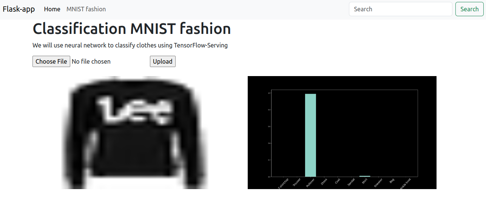

# Fashion Classification with Flask, TensorFlow Serving, and Docker



Excited to share my latest project where I dived into the intersection of fashion, machine learning, and deployment technologies! 🧵🤖 In this article, I walk you through the process of building a classification model using the Fashion MNIST dataset. 📸

We'll explore how Flask powers the backend, TensorFlow Serving ensures seamless model deployment, and Docker containerizes the entire application for portability and scalability. 

## MNIST model classification

The MNIST fashion dataset is built on images of clothes, all in black and white. The dimensions are 28x28, and each pixel ranges from 0 to 255. The first step is to create a model using Keras from TensorFlow. The model is simple (you can improve it), and the important part in this is to save the model.

```
model_name = "my_fashion_mnist_model/versions"
model_version = "0001"
model_path = Path(model_name) / model_version
model.save(model_path, save_format="tf")
```

With the new version, the 'model_version' needs to be changed. This format provides us with assistance in the construction of a serving system for machine learning models. The serving system accesses the new version automatically.

## Flask application

With Flask and the use of Bootstrap, we create an interface quickly. This interface will be simple: it loads an image and displays a bar plot showing the probabilities per class. The main parts of the Flask code is:

```
# Connection with TensorFlow serving
def TF_connection_prediction(image, through="RESTapi"):
    ... 
    return y_proba

# Classification model
def predict_MNIST_model(image):
    ...
    return plt 

# Upload img
def MNIST_fashion():
    ...
    return render_template("MNIST_fashion.html", status=status)
```

To deploy this in Docker we need the Dockerfile
```
FROM python:3.10.13-alpine3.19
WORKDIR /app
COPY ./requirements.txt .
COPY ./main.py .
COPY ./templates/ ./templates
COPY ./static/ ./static 
RUN pip install -r requirements.txt
ENV FLASK_APP=main.py
ENV FLASK_ENV=development
CMD [ "python3", "-m" , "flask", "run", "--host=0.0.0.0", "--port=3000"]
```

To connect the serving container and Flask application, we create a network and specify the network for each container during creation.
```
docker run -d -p 3000:3000 --network flask-tfserving-network --name flask_mnist 52348909c933
```

The network is 'flask-tfserving-network'

## Deploy TensorFlow serving

The deployment of TensorFlow in Docker is simple and direct:

```
docker  run -d -it --network flask-tfserving-network -v "./models/my_fashion_mnist_model/versions:/models/my_mnist_model" -e MODEL_NAME=my_mnist_model tensorflow/serving
```

The url to connect with TensorFlow serving is:
<code>http://172.18.0.2:8501/v1/models/my_mnist_model:predict</code>